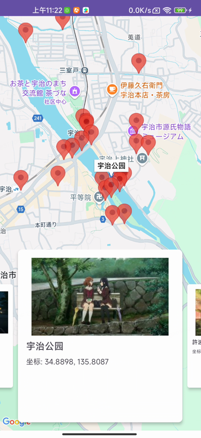
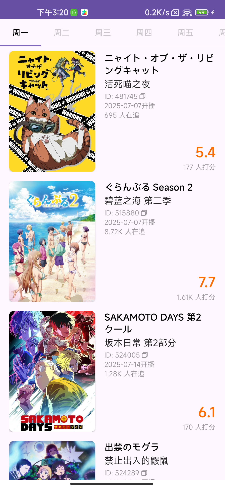

# **Android BangumiAPP主要目的是为了圣地巡礼**

感谢Anitabi和Bangumi提供的相关数据

> 📊ANIME的数据来自Bangumi网站 https://github.com/anitabi/anitabi.cn-document

> 🗺️圣地巡礼相关的数据来自Anitabi网站 https://github.com/bangumi/dev-docs

应用可以查看
    ✅当季新番信息
    ✅每日新番放送
    ✅Bangumi番剧排行榜

新番详情页中可以查看部分番剧现有的圣地巡礼地点，支持我的收藏

## 番剧详情页-圣地巡礼页

### 圣地巡礼页支持两种地图查看方式

#### 1. 半屏弹窗查看单个巡礼地点

#### 2. 全屏地图查看所有巡礼地点，底部卡片支持左右滑动切换地点

## Bangumi排行榜

## 时间表

## 番剧详情页-简介

## 番剧详情页-角色

## 番剧详情页-吐槽箱

### 持续更新中。。。
