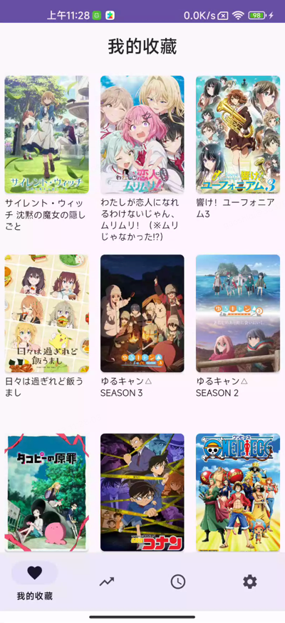

# 🌸 OtakuMap 圣地巡礼

> 一款专为动漫爱好者设计的圣地巡礼Android应用，让你的日本之旅更加精彩！

## 📱 应用简介

OtakuMap 圣地巡礼是一款结合了动漫信息浏览和圣地巡礼地点查看的综合性Android应用。通过整合Bangumi和Anitabi的丰富数据，为用户提供完整的动漫观看和圣地探访体验。

### 🎯 主要功能
#### 🗺️ 圣地巡礼
- ✅ 圣地巡礼地点查看
- ✅ 两种地图查看模式
- ✅ 半屏弹窗单点查看
- ✅ 全屏地图全景浏览
- ✅ 按集数分组展示
- ✅ 地点收藏功能
#### 📺 动漫信息
- ✅ 当季新番信息浏览
- ✅ 每日新番放送时间表
- ✅ Bangumi番剧排行榜
- ✅ 番剧详细信息（简介、角色、评论）
- ✅ 智能搜索功能

## 📊 数据来源

感谢以下优秀的开源项目和API服务：

> 📊 **ANIME数据来源**: [Bangumi](https://github.com/bangumi/dev-docs)
> 提供番剧信息、排行榜、用户评论等丰富数据

> 🗺️ **圣地巡礼数据**: [Anitabi](https://github.com/anitabi/anitabi.cn-document)
> 提供圣地巡礼地点、坐标、图片等地理信息

## 📸 应用截图

### 🗺️ 圣地巡礼功能

#### 番剧圣地巡礼列表，按集数分组展示，方便用户按集数查看
 

#### 📍 半屏弹窗查看模式
轻触地点标记，底部弹出详情卡片，支持跳转地图导航，支持圣地巡礼合照功能✨

 
 

#### 🌍 全屏地图浏览模式
全屏展示所有巡礼地点，底部卡片支持左右滑动切换

### 🎄 圣地收藏页面

### 📚 我的收藏页面
支持番剧收藏状态管理，点击状态角标唤起选择弹窗

 

### 🏆 排行榜页面

### 🔍 搜索功能

### 📅 时间表页面
一周新番时间表，按星期分组展示

 

### 📖 番剧详情页面

#### 简介页面

#### 角色页面  

#### 吐槽箱页面

## 🔄 更新日志

### v1.4.0 (当前版本)
- 📷 **新增相机模块**: 支持拍照功能，包含快门按钮动画和拍照时画面定格效果
- 🖼️ **相册多选功能**: 支持选择和删除多张照片，异步加载相册
- 🌍 **多语言支持**: 新增国际化支持
- 📚 **收藏页重构**: 全新 CollectionV2 使用 Compose 实现，新增追番状态管理
- 🎯 **状态选择仪表盘**: 优化收藏状态管理，支持点击状态角标唤起选择弹窗
- 🗺️ **地图功能增强**: 支持跳转 Google Map 导航
- 🔍 **时间表搜索**: 时间表页面新增搜索按钮
- 🐛 **修复问题**: 修复首次打开地图弹窗崩溃问题，优化搜索历史标签样式

### v1.3.0
- ✨ 新增图片加载器ImageLoader
- 🔄 搜索页接口替换，采用新搜索API

### v1.2.0
- ✨ 优化番剧详情页简介布局，采用卡片式设计
- ✨ 评分可视化展示（进度条 + 大字号评分）
- ✨ 收藏统计网格化展示
- ✨ 放送信息图标化展示
- 🔍 新增搜索功能入口
- 🐛 修复收藏功能相关问题

### v1.1.0
- ✨ 新增启动动画
- 🔍 新增番剧搜索功能
- 🐛 Bug修复与性能优化

### v1.0.0
- 🎉 首次发布
- 📺 番剧信息浏览
- 🗺️ 圣地巡礼地图功能
- 📚 收藏管理功能

## 🤝 贡献指南

欢迎任何形式的贡献！

### 贡献方式
1. 🐛 **Bug报告**: 发现问题请提交Issue
2. 💡 **功能建议**: 欢迎提出新功能想法
3. 🔧 **代码贡献**: Fork项目并提交Pull Request
4. 📝 **文档完善**: 改进README和代码注释

### 开发计划
- [ ] **搜索功能增强**: 支持更多搜索条件
- [ ] **离线缓存**: 支持离线查看收藏内容
- [ ] **深色模式**: 支持系统深色模式

## 📄 开源协议

本项目采用 [MIT License](LICENSE) 开源协议。

## 📞 联系我们

- 📧 **邮箱**: 526822901@qq.com

---

### 🙏 特别感谢

感谢所有为这个项目贡献代码、提出建议和反馈的开发者和用户！

**Made with ❤️ for Anime Lovers**

*持续更新中... ！* 🌟
